[WIP] WEBGPU Engine / 3D Space Curve, Surface, Vector Field grapher

  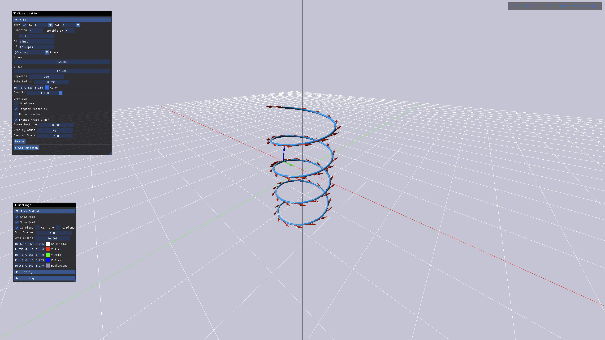     
  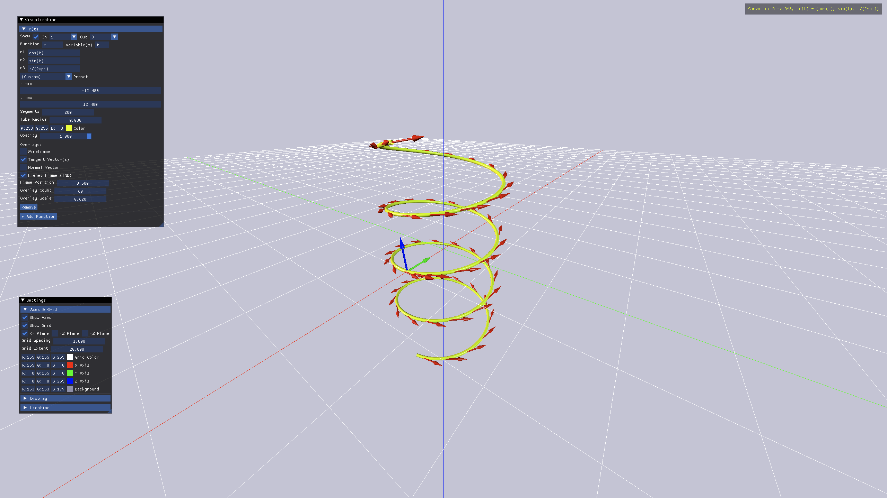                                                                                                                                                                                                                                                              
  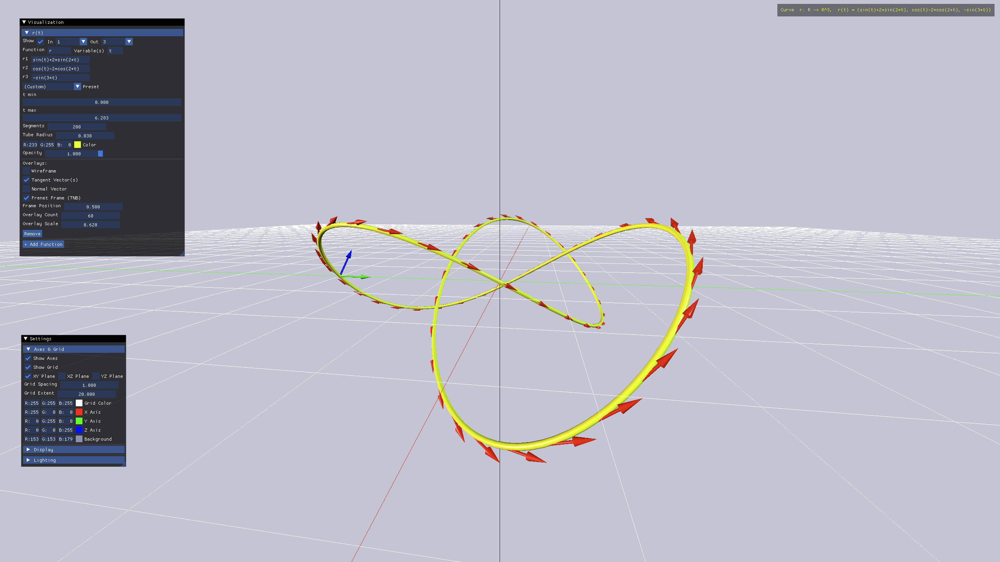                                                                                                                                                                                                                                                              
  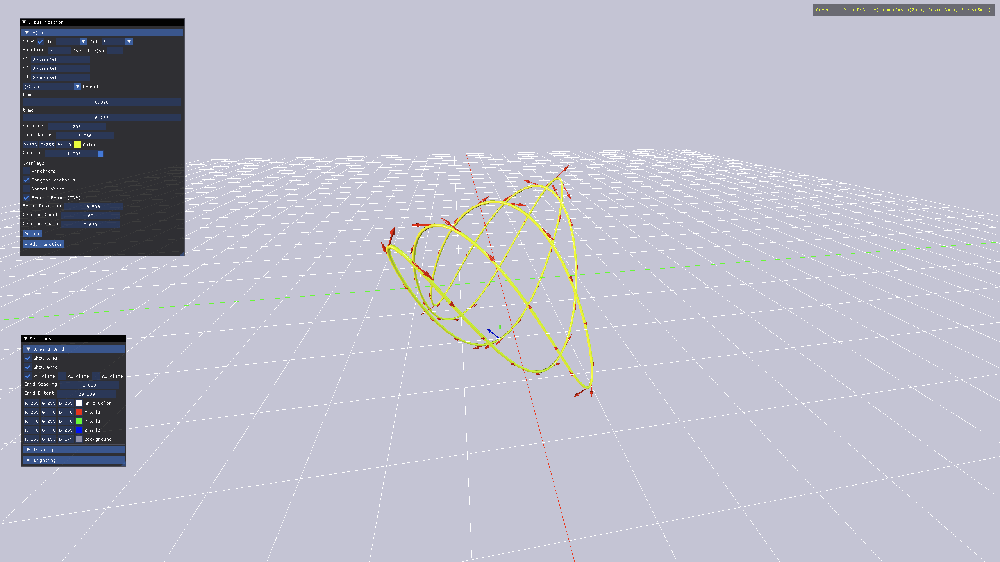                                                                                                                                                                                                                                                              
  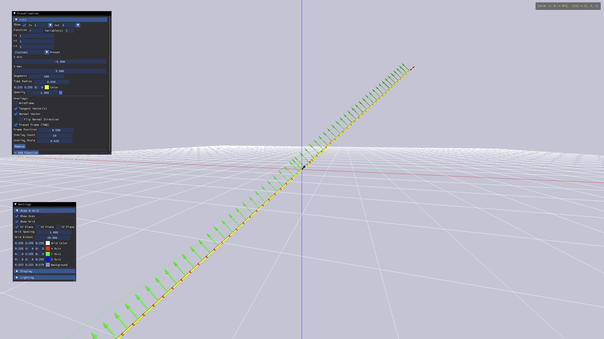                                                                                                                                                                                                                                                              
  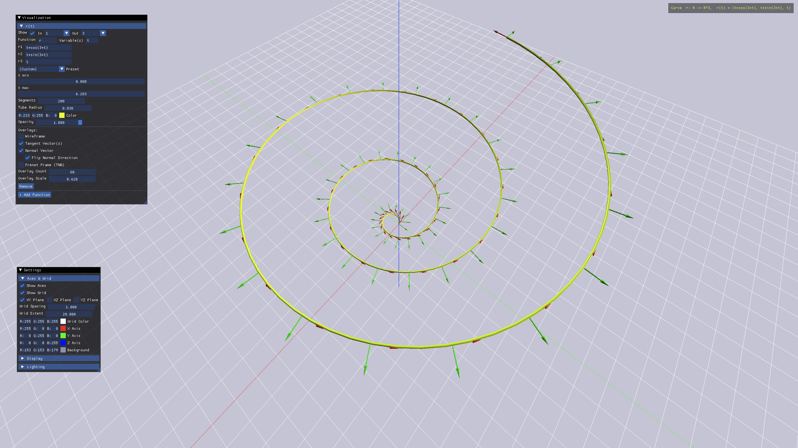
  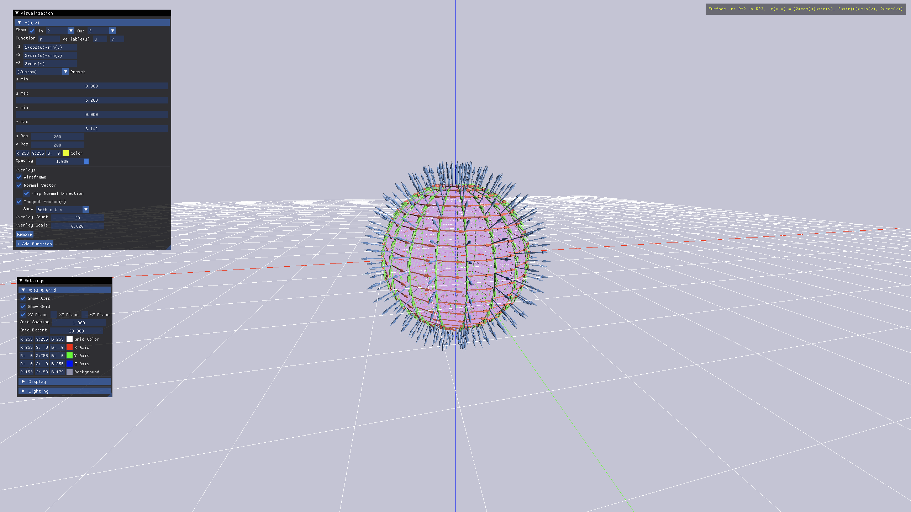
  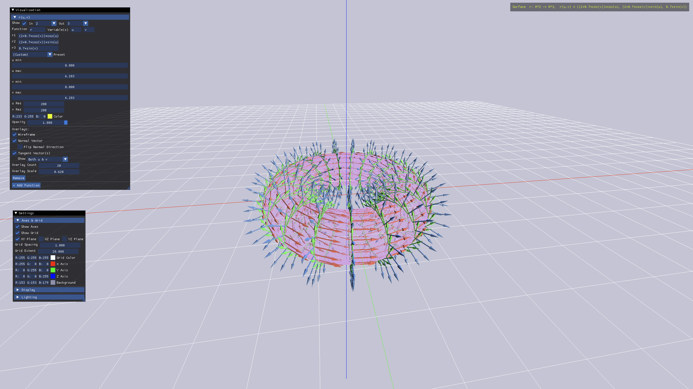
  
  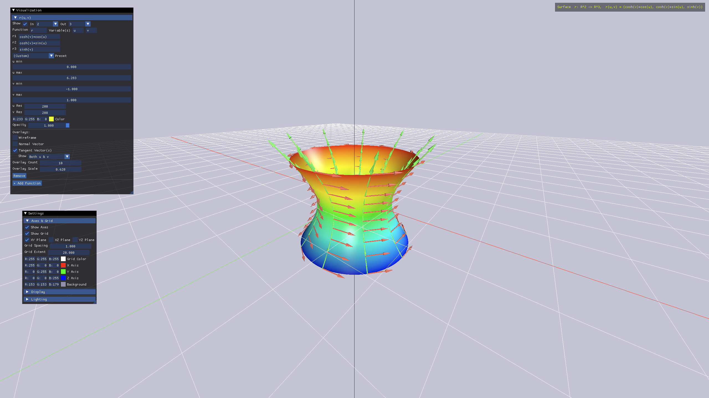
  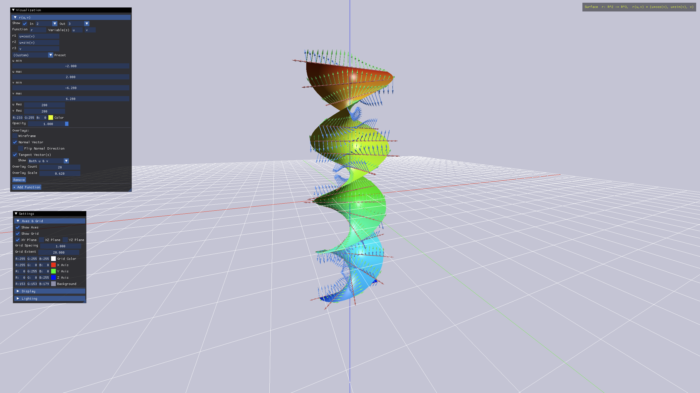
  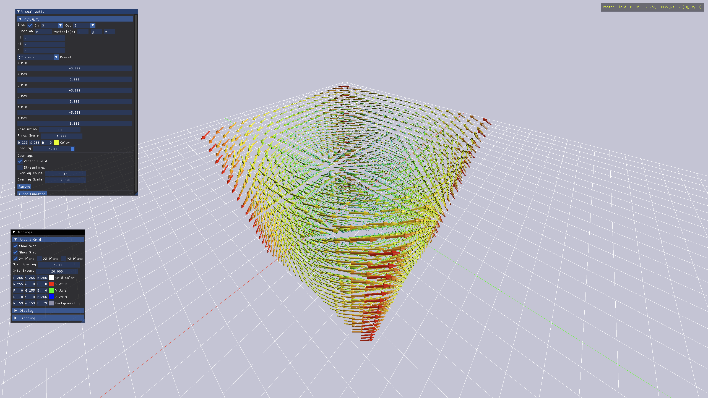
  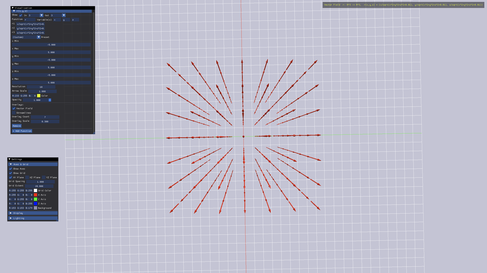
  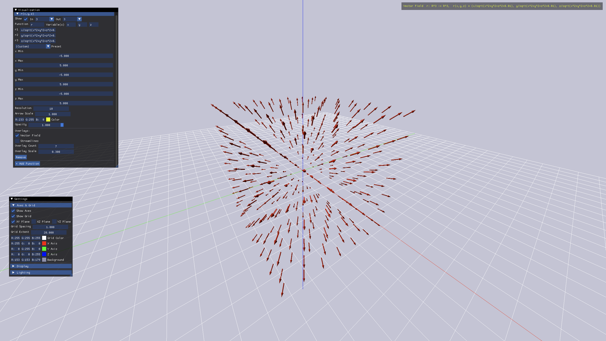
  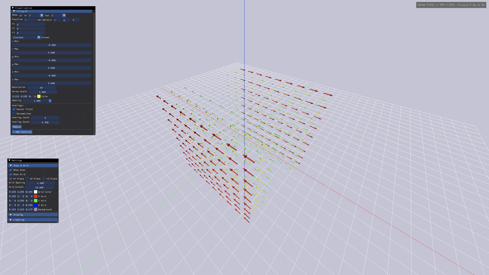
  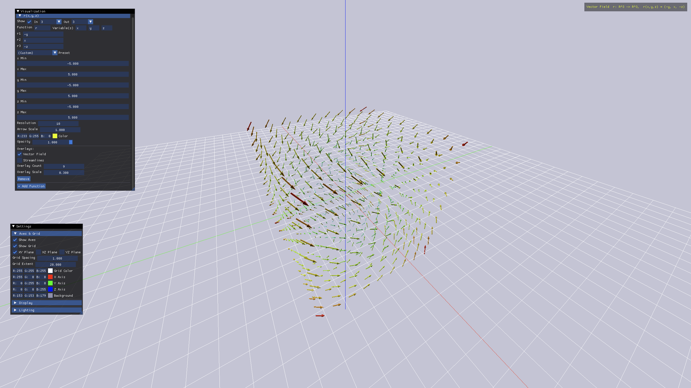
  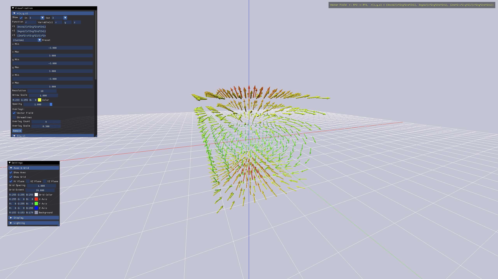
  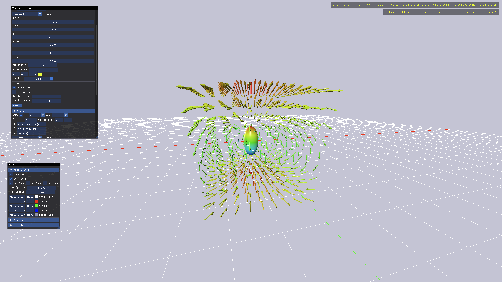

